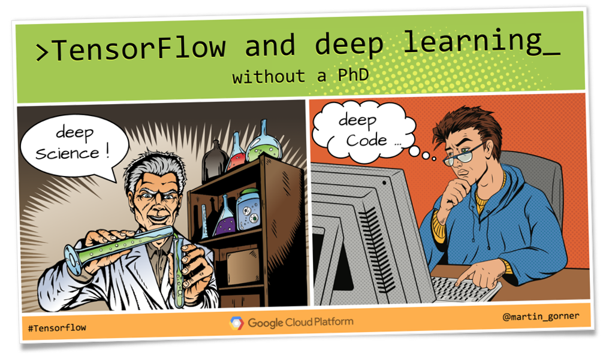
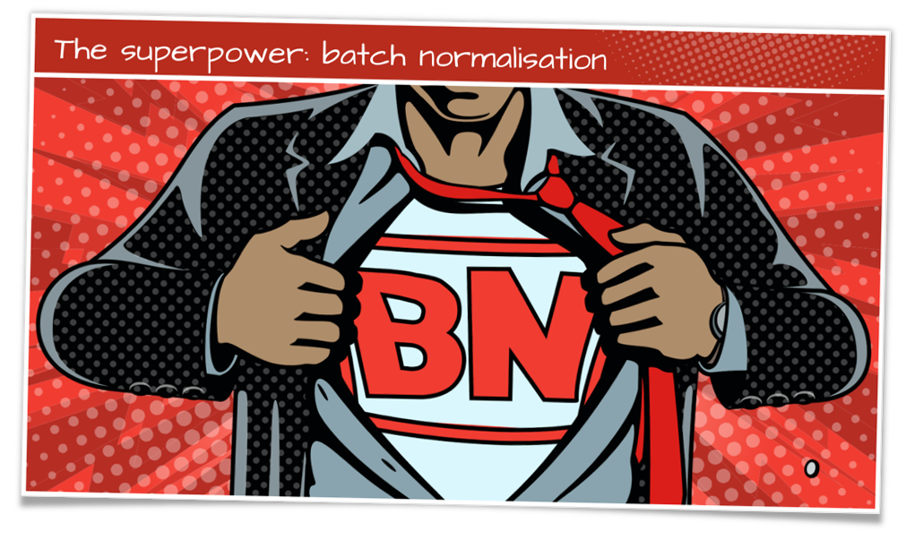

Sample code for "Tensorflow without a PhD" series.

#### [tensorflow-rl-pong](tensorflow-rl-pong)

A neural network trained to play the game of Pong for just the pixels of the game.
Uses reinforcement learning and policy gradients. The approach can be generalized to
other problem involving a non-differentiable step that cannot be trained using traditional supervised learning techniques.

---

<table border=0 width=100%>
    <tr>
        <td border=0 width="50%"></td>
        <td border=0 width="50%">
            

                     <a href="https://youtu.be/u4alGiomYP4">video</a> |
                     <a href="https://docs.google.com/presentation/d/1TVixw6ItiZ8igjp6U17tcgoFrLSaHWQmMOwjlgQY9co/pub?slide=id.p">slides</a> |
                     <a href="https://codelabs.developers.google.com/codelabs/cloud-tensorflow-mnist/#0">codelab</a> |
                     <a href="https://github.com/martin-gorner/tensorflow-mnist-tutorial">code</a>  

                     
The basics of building neural networks for software engineers. Neural weights and biases, activation functions, softmax, cross-entropy, supervised learning and gradient descent.
                     Tips and best practices for efficient training: learning rate decay, dropout regularisation and the intricacies of overfitting. Dense and convolutional neural networks. This session starts with low-level
                     Tensorflow and also has a sample of high-level Tensorflow code using layers and Datasets. Duration: 55 min
</td>
    </tr>
    <tr>
        <td border=0  width="50%">

                                          <a href="https://youtu.be/vq2nnJ4g6N0?t=76m">video</a> |
                                          <a href="https://docs.google.com/presentation/d/18MiZndRCOxB7g-TcCl2EZOElS5udVaCuxnGznLnmOlE/pub?slide=id.g1245051c73_0_25">slides</a> |
                                          <a href="https://github.com/martin-gorner/tensorflow-mnist-tutorial/blob/master/README_BATCHNORM.md">code</a>  

                                          
What is batch normalisation, How to use it appropriately and how to see if it is working or not. Duration: 25 min
</td>
        <td border=0  width="50%"></td>
    </tr>
</table>

---

Other samples from "Tensorflow without a PhD" talks will be transferred into this repository soon:

- Tensorflow and deep learning without a PhD 
[video](https://youtu.be/u4alGiomYP4) |
[slides](https://docs.google.com/presentation/d/1TVixw6ItiZ8igjp6U17tcgoFrLSaHWQmMOwjlgQY9co/pub?slide=id.p) |
[codelab](https://codelabs.developers.google.com/codelabs/cloud-tensorflow-mnist/#0) |
[code](https://github.com/martin-gorner/tensorflow-mnist-tutorial) 

- Tensorflow, deep learning and recurrent neural networks, without a PhD 
[video](https://youtu.be/fTUwdXUFfI8) |
[slides](https://docs.google.com/presentation/d/18MiZndRCOxB7g-TcCl2EZOElS5udVaCuxnGznLnmOlE/pub?slide=id.p) |
[codelab](https://github.com/martin-gorner/tensorflow-rnn-tutorial) |
[code](https://github.com/martin-gorner/tensorflow-rnn-shakespeare)

- Tensorflow, deep learning and modern convnets, without a PhD 
[video](https://youtu.be/vaL1I2BD_xY) |
[slides](https://docs.google.com/presentation/d/19u0Tm0JHL5tpzyarLILvy4qLSuDBFNNx2hwSvZsFPI0/pub?slide=id.g292aa67486_0_593) |
code: soon

- Tensorflow, deep learning and modern RNN architectures, without a PhD 
[video](https://youtu.be/pzOzmxCR37I) |
[slides](https://docs.google.com/presentation/d/17gLPozfb-l3WCR8FnejNJD9tEI_igTq1YqIXzCtOR14/pub?slide=id.g298ac04a83_1_26) |
code: soon

- Batch normalisation: a new superpower 
[video](https://youtu.be/vq2nnJ4g6N0?t=76m) |
[slides](https://docs.google.com/presentation/d/18MiZndRCOxB7g-TcCl2EZOElS5udVaCuxnGznLnmOlE/pub?slide=id.g1245051c73_0_25) |
[code](https://github.com/martin-gorner/tensorflow-mnist-tutorial/blob/master/README_BATCHNORM.md)

- Tensorflow and deep reinforcement learning, without a PhD 
[video](https://youtu.be/t1A3NTttvBA) |
[slides](https://docs.google.com/presentation/d/1qLVvgKxZlM6_oOZ4-ZoOAB0wTh2IdhbFvuBhsMvmK9I/pub?slide=id.g28cd71339f_0_0) |
[code](tensorflow-rl-pong)

 
 
---

*Disclaimer: This is not an official Google product but sample code provided for an educational purpose*