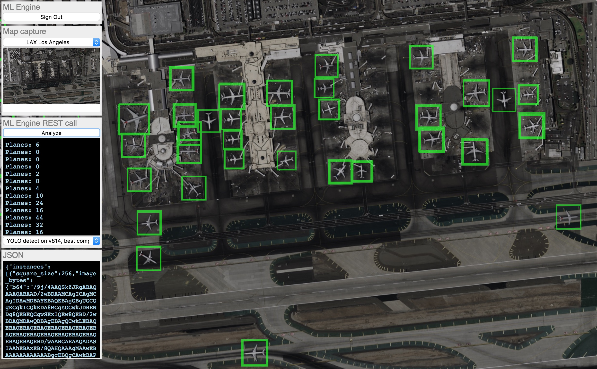
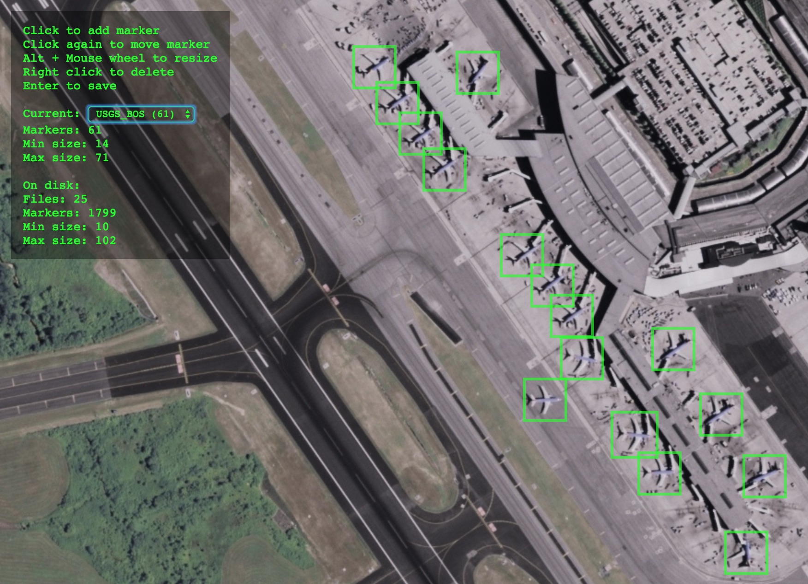

# Airplane detection with Squeezenet and YOLO (You Look Only Once)

## Introduction

This is a code sample for the talk "Tensorflow, deep learning and modern
convolutional neural nets, without a PhD" ([video](https://youtu.be/KC4201o83W0) |
[slides](https://docs.google.com/presentation/d/19u0Tm0JHL5tpzyarLILvy4qLSuDBFNNx2hwSvZsFPI0/pub))

Author: Martin Görner

## The model
You will find the squeezenet model in the [trainer_yolo/model.py](trainer_yolo/model.py) file
in function `model_core_configurable_squeezenet`. It has a configurable
number of layers and might therefore not be very readable. A more readable
12 and 17 layer versions can be found in functions `model_core_squeezenet12` and `model_core_squeezenet17`.
The YOLO (You Look Only Once) paper uses a different architecture they call
"darknet" which is also provided for your review in functions `model_core_darknet`
and `model_core_darknet17`. In practice it was found that the squeezenet
architecture was more effective in most cases for the task of detecting airplanes.

These core models are standard sequences convolutional layaers. Additional layers are
needed to provide detection capabilities. They can be found in file
[trainer_yolo/model_layers.py](trainer_yolo/model_layers.py) function `YOLO_head`. 

## Training

### Cloud training using ML Engine

A script is provided for running the training on ML Engine. It implements
auto-incrementing job names so that successive trainings are called job001, job002 and so on.
Apart from that, it is contains little more that the `gcloud ml-engine jobs submit training`.
The script is [cloudrun_yolo.bash](cloudrun_yolo.bash). By default, it trains a 
17 layer squeezenet/YOLO detection model. To start training, fill out the prerequisites and run the script.

Prerequisites:
* Go to the Google cloud console at [https://console.cloud.google.com/](https://console.cloud.google.com/), create a project, enable billing.
* In the console, create a [Cloud Storage bucket](https://console.cloud.google.com/storage/). Use storage
class "regional" and put it in your preferred [region that has ML-Engine resources](https://cloud.google.com/ml-engine/docs/tensorflow/regions).
This bucket is where your trained model will be stored.
* Download and install the [Googe Cloud SDK](https://cloud.google.com/sdk/) so that you can use the "gcloud" command line utility.
* Run `gcloud init` to configure your project and sign in with your account.

Now edit the cloudrun_yolo.bash file and fill in your bucket name, project name
and region.  You are ready to train. The default training configuration uses a single
NVIDIA P100 GPU. If you are looking for the TPU version, please switch to the "tpu" branch.

 ```bash
 # assuming the current directory is tensorflow-planespotting
 ./cloudrun_yolo.bash
 ```
 
 You can switch to cluster training, using 4 GPUs for training and 1 for evaluations,
 by using the [config-distributed.yaml](config-distributed.yaml) config file. Edit the
 script and point the CONFIG variable to it.

### Local
You can train a basic 12 layer model locally with default settings
using this command line. The training will be done using publicly available data.

```bash
# assuming the current directory is tensorflow-planespotting
python -m trainer_yolo.main --data gs://planespotting-data-public/USGS_public_domain_photos

```

### Data and data generation
The dataset is made of large aerial photos and ROIs (square Regions Of Interest)
marking all airplanes. You can train directly on the aerial imagery. The model can only
handle 256x256 pixel tiles so these will be generated on the fly.

When training the model multiple times, it is a good idea to compute the tiles
once and for all and store them along with the ROI information in TFRecord format.
This also allows better shuffling, which is important for the final accuracy.

Both formats are available in a public Cloud Storage bucket. You can list them using `gsutil`:
 ```bash
 # large aerial photographs and ROI files:
 gsutil ls -l gs://planespotting-data-public/USGS_public_domain_photos
 gsutil ls -l gs://planespotting-data-public/USGS_public_domain_photos_eval
 # 256x256 pixel tiles and adjusted ROI files:
 gsutil ls -l gs://planespotting-data-public/tiles_from_USGS_photos
 gsutil ls -l gs://planespotting-data-public/tiles_from_USGS_photos_eval 
 ```

You can run the data generation alone using this script. Make sure you provide your
own bucket for output data:

 ```bash
 # assuming the current directory is tensorflow-planespotting
 ./cloudrun_yolo_datagen.bash
 ```
 
 The YOLO model can be trained both from large aerial photos and from 256x256 tiles
 in TFRecord format. The following command line parameter switches between the two
 modes. Adjust it in the [cloudrun_yolo.bash](cloudrun_yolo.bash) file:
 ```bash
 # To train train from large aerial photographs use:
 --data gs://planespotting-data-public/USGS_public_domain_photos
 # Alternatively, to train from 256x256 tiles in TFRecord format use: 
 --tiledata gs://planespotting-data-public/tiles_from_USGS_photos
 ```
 
Eval data is automatically picked up from a folder with a similar
name with `_eval` appended to the name.

### Deploying a model

Trained models can be deployed to ML Engine for online or batch prediction serving.
This demo uses the online mode. The model is deployed behind a fully managed and autoscaled 
REST API.

Once you have trained a model, go the the [Google Cloud console, ML Engine section,
Models subsection](https://console.cloud.google.com/mlengine/models) and click on
"New model" then "New version". Select the latest model checkpoint you have trained.
It should be something like `gs://<YOUR-BUCKET>/jobs/airplaneXXX/export/planespotting/1529794205/`.
You model will be ready to serve within a minute ot two.

### Demo time: testing your model

A test UI written in Javascrip/HTML is provided. You can use it to navigate
Google Maps in satellite mode, and analyze any aerial imagery you find to try and spot
airplanes. You can find it in [webui](webui).



Once you have trained and deployed a model, edit the [webui/index.html](webui/index.html)
so that the list of models in the select box contains yours, selected by default.
You can then launch the demo from any local web server. Please make sure to serve it
from http://localhost:8000. The Google Maps API key for this demo is restricted to localhost:8000.
 
```bash
# assuming the current directory is tensorflow-planespotting
cd webui
python -m SimpleHTTPServer 8000  
```
In the UI, authenticate with ML Engine, select an airport and a model and click "analyze".
Models served from ML Engine are meant to be accessed from the server side of your
application so the authentication step is usually performed on the server. If
you want to configure your model so that anyone can access it, you will have to
[set up an Apigee Edge proxy in front of it](https://cloud.google.com/solutions/serving-machine-learning-models-using-apigee-edge-and-ml-engine)
and make the Apigee endpoint public.

### Contributing to the dataset

This dataset was created by hand by tagging public aerial imagery downloaded from
the U.S. Geological Survey. A Javascript/HTML UI is provided should you want to tag
additional images. You will find it in [webui-mark](webui-mark). You can
run it from a local web browser:

```bash
# assuming the current directory is tensorflow-planespotting
cd webui-mark
# copy the existing data, add yours if you have any
mkdir USGS_public_domain_airports
gsutil -m cp gs://planespotting-data-public/USGS_public_domain_photos/* USGS_public_domain_airports
gsutil -m cp gs://planespotting-data-public/USGS_public_domain_photos_eval/* USGS_public_domain_airports
# run from local server (any port will do)
python -m SimpleHTTPServer 8000  
```
If you are adding your own files for tagging, you will have to reference them in the
list in [webui-mark/mark.js](webui-mark/mark.js) otherwise they will not appear in the UI.



If you tag additional images and want to add them to the public dataset, open a GitHub issue
and I will gladly accept your contribution, provided the images are public.

### Classifier-based model

The model that I start from in my talk is based on a classifier of 20x20 tiles
that is then run many times on a 256x256 image to create a detector.
The performance of this approach is not as good as the YOLO model. You can
find the code in [trainer](trainer). The dataset can be downloaded from [Kaggle/planesnet](https://www.kaggle.com/rhammell/planesnet).

One interesting thing about this model is that the splitting of input images
into 20x20 tiles (so that they can be run through the classifier) was done
in the `serving_input_fn` function so that it happens on the fly when the
model is deployed on ML Engine. It is a good example of how deployed models
can run preprocessing on their input data directly on ML Engine while serving.
Code here: [trainer/train.py](trainer/train.py) function `serving_input_fn`.
 
