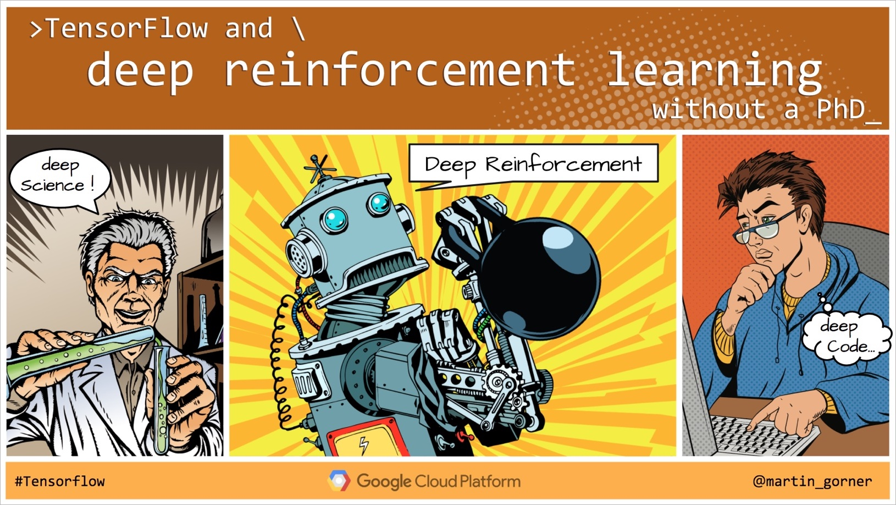

# Reinforcement Learning Pong on Cloud Machine Learning Engine

## Introduction

This is a code sample for the talk "Tensorflow and deep reinforcement learning, without a PhD" ([video](https://youtu.be/aRKOJHRbXeo) | [slides](https://goo.gl/CB8xNH))

Author: Yu-Han Liu

## Prerequisites

- Python 2.7 or Python 3
- [Google Cloud SDK](https://cloud.google.com/sdk/downloads#interactive)

## Installation

```
pip install -r requirements.txt
```

To verify that the packages are installed successfully, run the following command to see a round of Pong gameplay rendered on screen:

```
python -m trainer.task --render
```

This package comes with a trained checkpoint.  To play a game with it, run:

```
python -m trainer.task --render --restore --output-dir ./demo-checkpoint
```

You can also run the following command to train locally.
By default, outputs (checkpoints and TensorBoard summaries) are written to `/tmp/pong_output`:

```
python -m trainer.task
```

## Run training job

To submit the training job to Cloud Machine Learning Engine:

```
GCS_BUCKET=<gs://YOUR-BUCKET/> bash submit.sh
```


## Monitor training job

1. You can monitor the training job and find the logs in the [cloud console](https://console.cloud.google.com/mlengine/jobs).

1. To monitor the progress of training, use TensorBoard:

    ```
    tensorboard --logdir gs://YOUR-BUCKET/JOB_NAME
    ```

    Here `JOB_NAME` is of the format of `"pong_[timestamp]"`, which you can find on the console.

1. To watch Pong gameplay with a trained model, run:

    ```
    python -m trainer.task --output-dir gs://YOUR-BUCKET/JOB_NAME --restore --render
    ```

    It might take about 10 minutes before the first checkpoint is saved, and it might take a few hours before the trained model can consistently win a some points.  It might take about 20 hours of training before the trained model can consistently win games.

---
    
*Disclaimer: This is not an official Google product but sample code provided for an educational purpose*


